**Create a RedHat Instaance**

**Create instance in south africa region
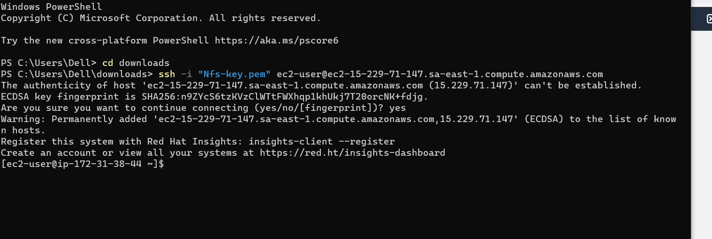
`ssh -i "ssh -i "Nfs-key.pem" ec2-user@ec2-15-229-71-147.sa-east-1.compute.amazonaws.com`

-Set ec2-user as user
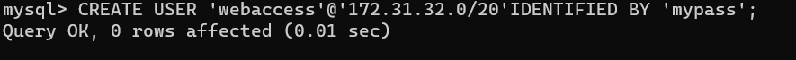

## Launch an EC2 Instance-Webserver
1. Prepare a Web Server
-Create 3 volumes in the same AZ(each of 10GiB)
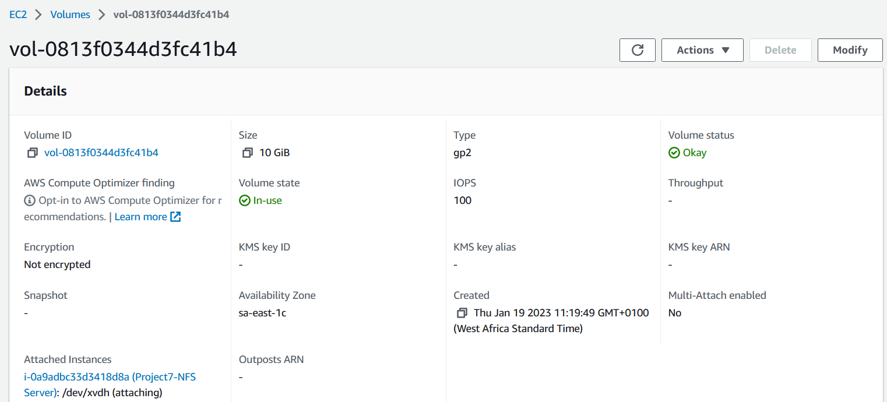

3. Confirm
`lsblk`
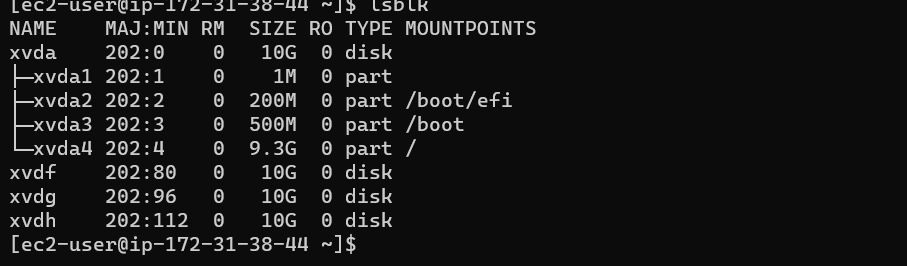

4. `df -h`

5.`sudo gdisk /dev/xvdf`
`sudo gdisk /dev/xvdg`
`sudo gdisk /dev/xvdh`
-type p
-next n with 8e00
-w
-y

`lsblk`
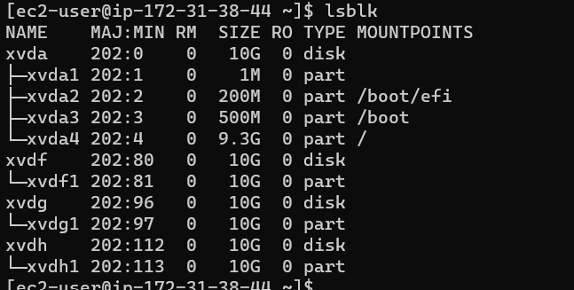

6. Install lvm2
`sudo yum install lvm2`
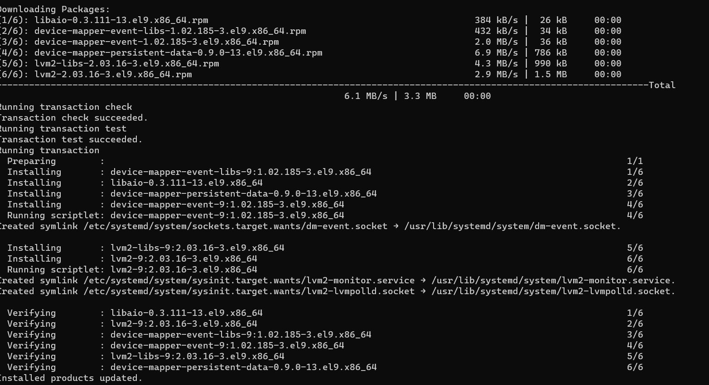

`sudo lvmdiskscan`
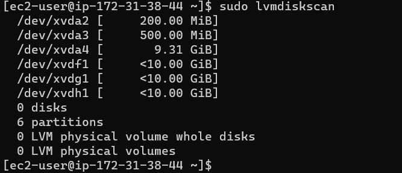

7. to mark as physical volumes
`sudo pvcreate /dev/xvdf1`
`sudo pvcreate /dev/xvdg1`
`sudo pvcreate /dev/xvdh1`
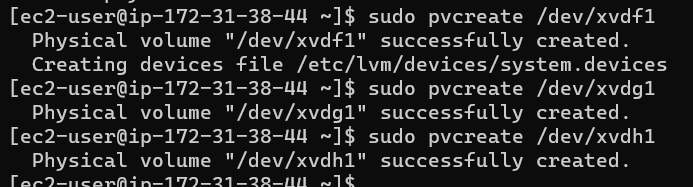

8. Verify
`sudo pvs`
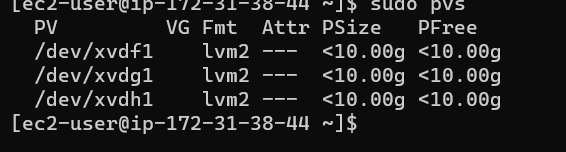

9. Add all 3 volumes to volume group VG nfsdata-vg
`sudo vgcreate nfsdata-vg /dev/xvdh1 /dev/xvdg1 /dev/xvdf1`
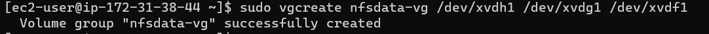

10. Verify
`sudo vgs`
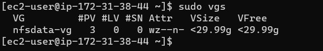

11. lvcreate utility to create 3 logical volumes(lv-opt,lv-apps,lv-logs)
`sudo lvcreate -n lv-opt -L 11G nfsdata-vg`
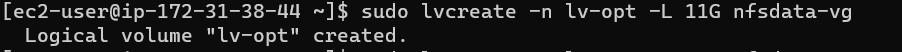
`sudo lvcreate -n lv-apps -L 11G nfsdata-vg`
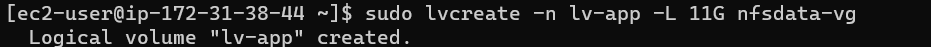
`sudo lvcreate -n lv-logs -L 5G nfsdata-vg`
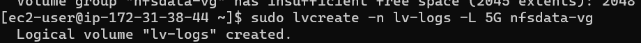

12. Confirm Logical volumes
`sudo lvs`
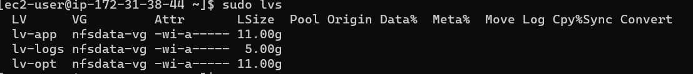

13. Verify entire setup
`sudo vgdisplay -v #view complete setup - VG, PV, and LV`

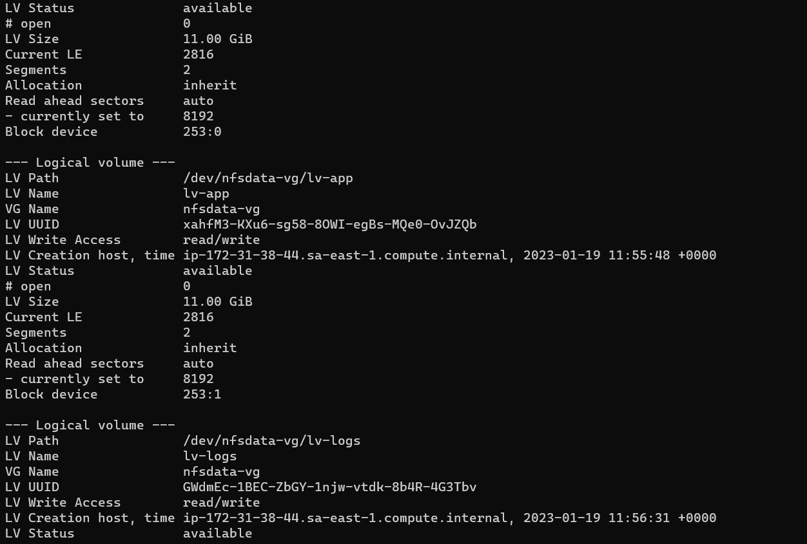
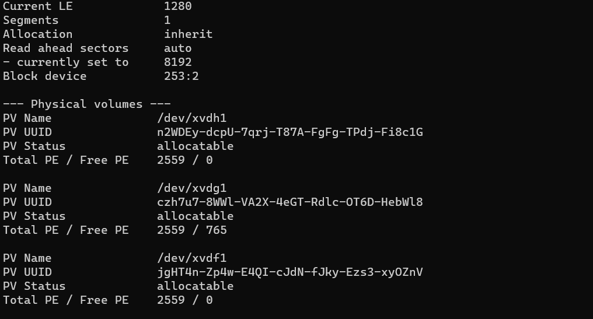

`sudo lsblk`
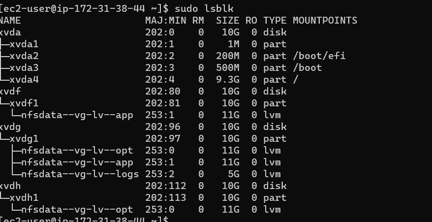

14. Format the LV with xfs filesystem
`sudo mkfs -t xfs /dev/nfsdata-vg/lv-opt`
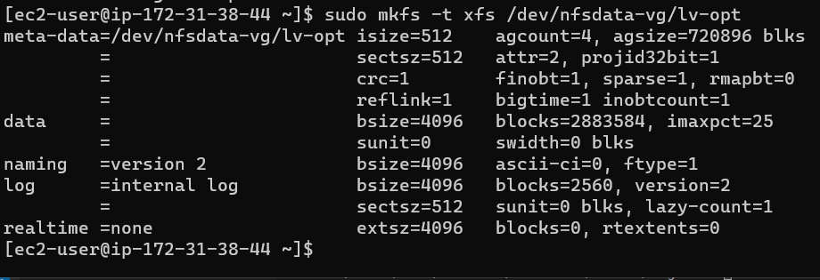
`sudo mkfs -t xfs /dev/nfsdata-vg/lv-app`
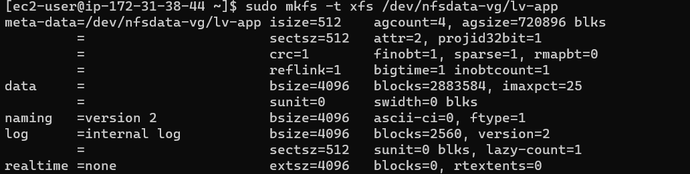
`sudo mkfs -t xfs /dev/nfsdata-vg/lv-logs`
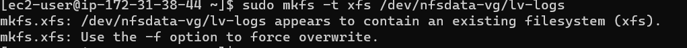

**Rename vg nfsdata-vg to webdata-vg**
`sudo vgrename nfsdata-vg webdata-vg`
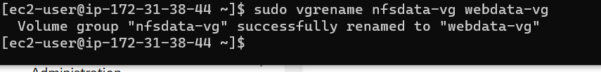

`sudo mkdir /mnt && cd /mnt`
Create /mnt/apps to be used by webservers
`sudo mkdir -p /mnt/apps`
Create /mnt/logs to be used by webserver logs
`sudo mkdir -p /mnt/logs`

Create /mnt/opt to be used by Jenkins server
`sudo mkdir /mnt/opt`

Mount lv-app on /mnt/apps – To be used by webservers
`sudo mount /dev/webdata-vg/lv-app /mnt/apps`
Mount lv-logs on /mnt/logs – To be used by webserver logs
`sudo mount /dev/webdata-vg/lv-logs /mnt/logs`
Mount lv-opt on /mnt/opt – To be used by Jenkins server in Project 8

4.Install NFS server, configure it to start on reboot and make sure it is u and running

`sudo yum -y update`
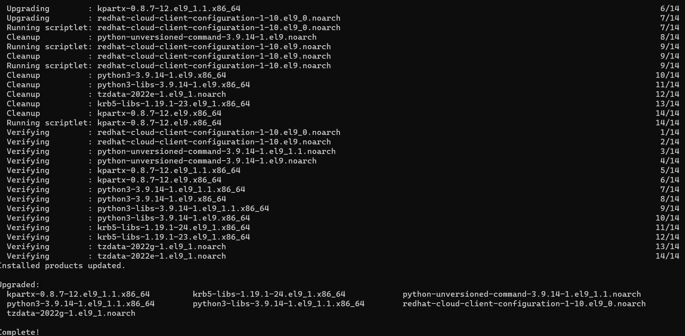
`sudo yum install nfs-utils -y`
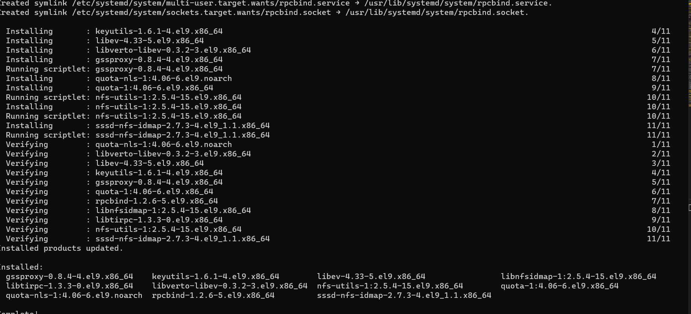
`sudo systemctl start nfs-server.service`
`sudo systemctl enable nfs-server.service`
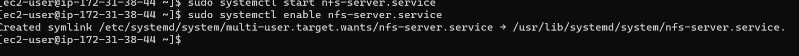
`sudo systemctl status nfs-server.service`
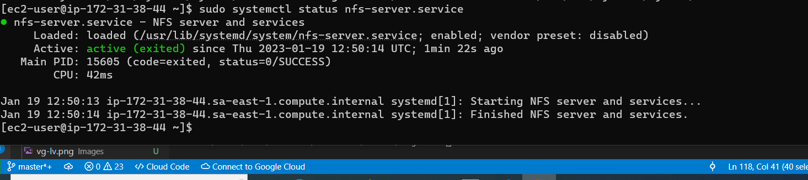

5. Confirm Subnet link to cidr
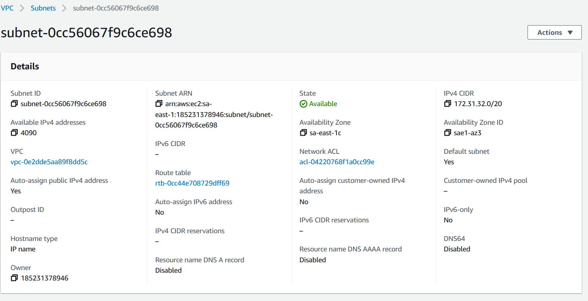

- Make sure we set up permission that will allow our Web servers to read, write and execute files on NFS:

`sudo chown -R nobody: /mnt/app`
`sudo chown -R nobody: /mnt/logs`
`sudo chown -R nobody: /mnt/opt`

`sudo chmod -R 777 /mnt/apps`
`sudo chmod -R 777 /mnt/logs`
`sudo chmod -R 777 /mnt/opt`

`sudo systemctl restart nfs-server.service`

- Sync
`sudo rsync /mnt/logs`
`sudo rsync /mnt/apps`
`sudo rsync /mnt/opt`
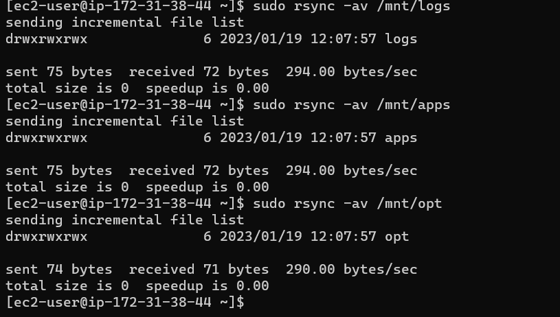

- Configure access to NFS for clients within the same subnet (example of Subnet CIDR – 172.31.32.0/20 ):

sudo vi /etc/exports
>
/mnt/apps <Subnet-172.31.32.0/20>(rw,sync,no_all_squash,no_root_squash)
/mnt/logs <Subnet-172.31.32.0/20>(rw,sync,no_all_squash,no_root_squash)
/mnt/opt <Subnet-172.31.32.0/20>(rw,sync,no_all_squash,no_root_squash)

Esc + :wq!

`sudo exportfs -arv`
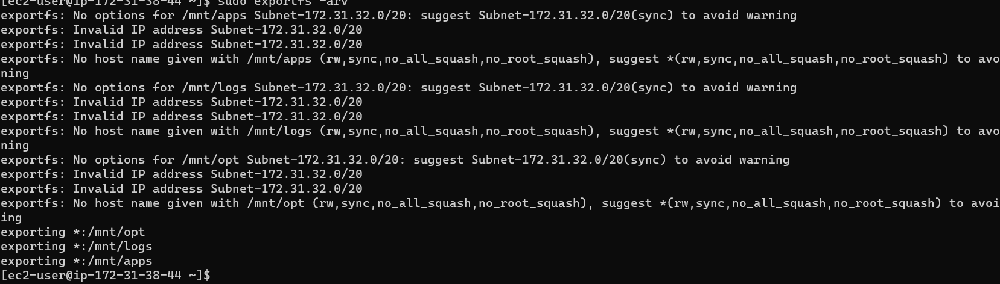

6. Check which port is used by NFS and open it using Security Groups (add new Inbound Rule)
`rpcinfo -p | grep nfs`
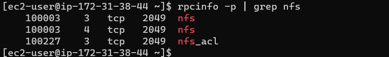

-Configuring inbound rules for port TCP 111,UDP 111,UDP 2029,NFS 2049
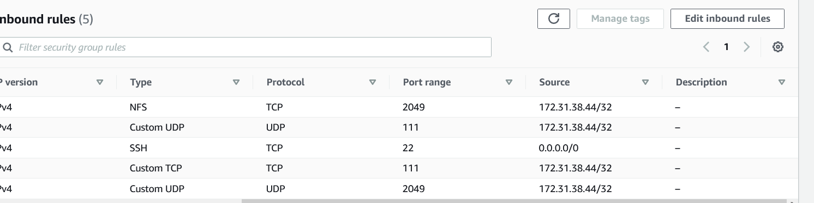

## Step 2 — Configure the database server
`sudo yum update`
- Install Mysql server
`sudo yum install mysql-server`
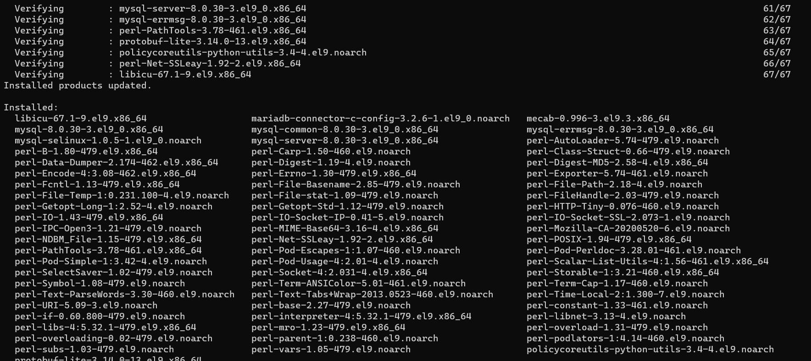

`sudo systemctl restart mysqld`
`sudo systemctl enable mysqld`
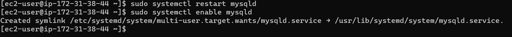

- Create a database and name it tooling
`sudo mysql`

- Create a database user and name it webaccess
>CREATE DATABASE tooling;
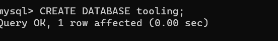
>CREATE USER `webaccess`@`172.31.38.44` IDENTIFIED BY 'mypass';

- Grant permission to webaccess user on tooling database to do anything only from the webservers subnet cidr
>GRANT ALL ON tooling.* TO 'webaccess'@'172.31.32.0/20';
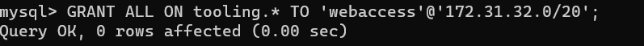
>FLUSH PRIVILEGES;
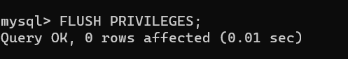
>SHOW DATABASES;
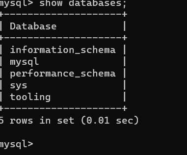
exit

## Mount /var/www on lv-app
`sudo mkdir /var/www`
`sudo mount /dev/webdata-vg/lv-app /var/www`

## NEXT Configure another instance

1.  Launch a new EC2 instance with RHEL 8 Operating System
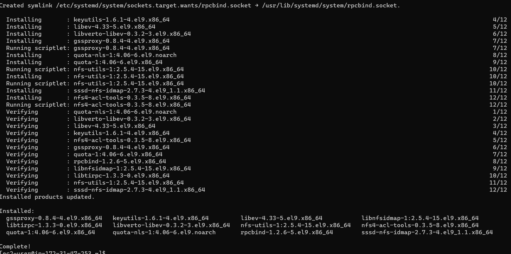
2. Install NFS client

`sudo yum install nfs-utils nfs4-acl-tools -y`
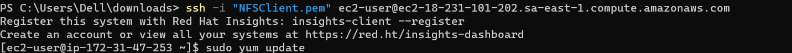

3. Mount /var/www/ and target the NFS server’s export for apps
`sudo mkdir /var/www`
`sudo mount -t nfs -o rw,nosuid 172.31.38.44:/mnt/apps /var/www`

4. Verify that NFS was mounted successfully by running df -h. Make sure that the changes will persist on Web Server after reboot:
`df -h`
`sudo vi /etc/fstab`

add following line

172.31.38.44:/mnt/apps /var/www nfs defaults 0 0

5. Install Remi’s repository, Apache and PHP

`sudo yum install httpd -y`
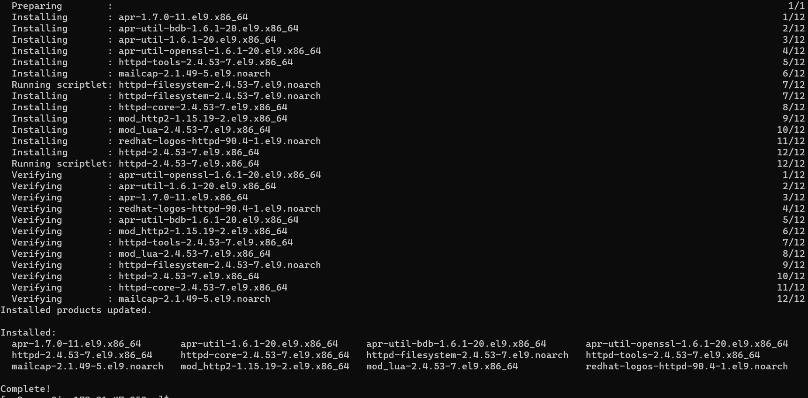

`sudo dnf install https://dl.fedoraproject.org/pub/epel/epel-release-latest-8.noarch.rpm`
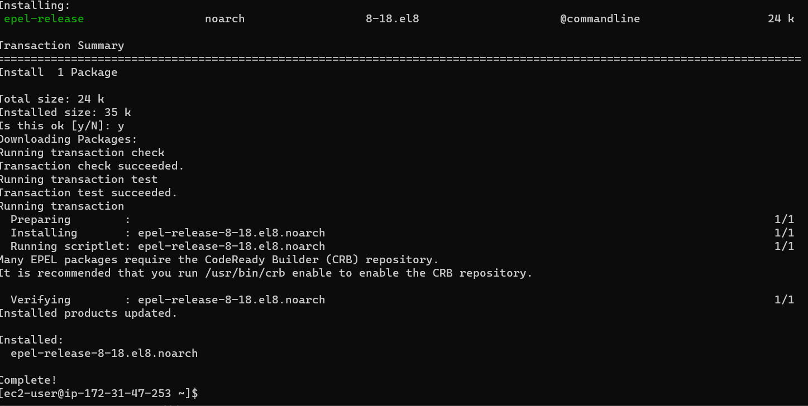

`sudo dnf install dnf-utils http://rpms.remirepo.net/enterprise/remi-release-8.rpm`
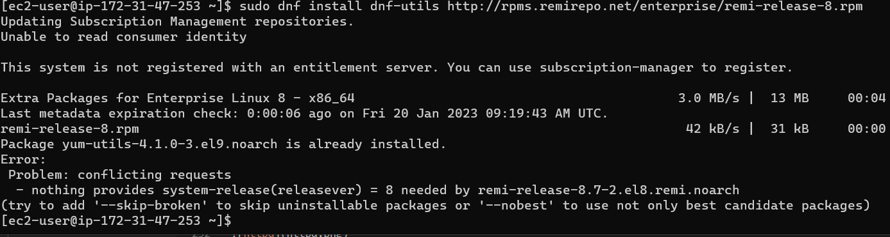
`sudo dnf module reset php`
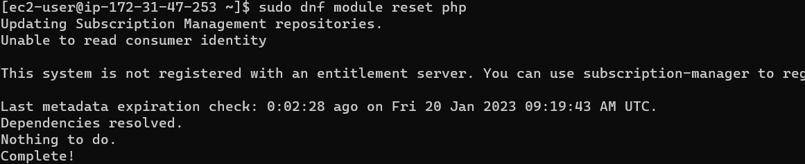
`sudo dnf module enable php:remi-7.4`
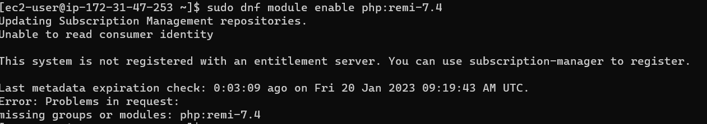
`sudo dnf install php php-opcache php-gd php-curl php-mysqlnd`
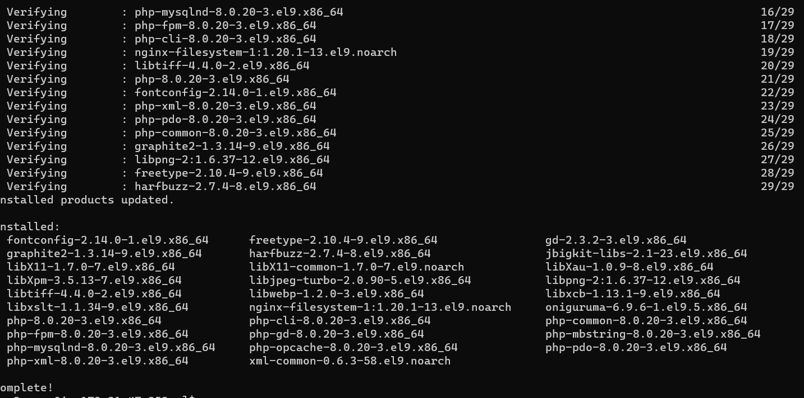
`sudo systemctl start php-fpm`

`sudo systemctl enable php-fpm`
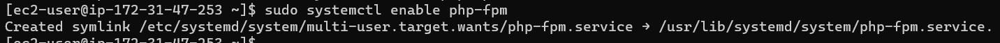
`sudo setsebool -P httpd_execmem 1`

**Repeat steps 1-5 for another 2 Web Servers**
Create an instance Webserver1 and Webserver2
`ssh -i "Webs-key.pem" ec2-user@ec2-18-231-164-144.sa-east-1.compute.amazonaws.com`

`ssh -i "Webs2-key.pem" ec2-user@ec2-18-228-16-28.sa-east-1.compute.amazonaws.com`

Add Inbound rule for NFS Server

Step 1 -5

Verify that Apache files and directories are available on the Web Server in /var/www and also on the NFS server in /mnt/apps. If you see the same files – it means NFS is mounted correctly. You can try to create a new file touch test.txt from one server and check if the same file is accessible from other Web Servers.

-Create test.txt on Webserver2
`cd /var/www` 
`sudo vi test.txt`
- Insert
>This is to verify that test.txt is accessable.

    Locate the log folder for Apache on the Web Server and mount it to NFS server’s export for logs. Repeat step №4 to make sure the mount point will persist after reboot.

    Fork the tooling source code from Darey.io Github Account to your Github account. (Learn how to fork a repo here)

    Deploy the tooling website’s code to the Webserver. Ensure that the html folder from the repository is deployed to /var/www/html

Note 1: Do not forget to open TCP port 80 on the Web Server.

Note 2: If you encounter 403 Error – check permissions to your /var/www/html folder and also disable SELinux sudo setenforce 0
To make this change permanent – open following config file sudo vi /etc/sysconfig/selinux and set SELINUX=disabledthen restrt httpd.

